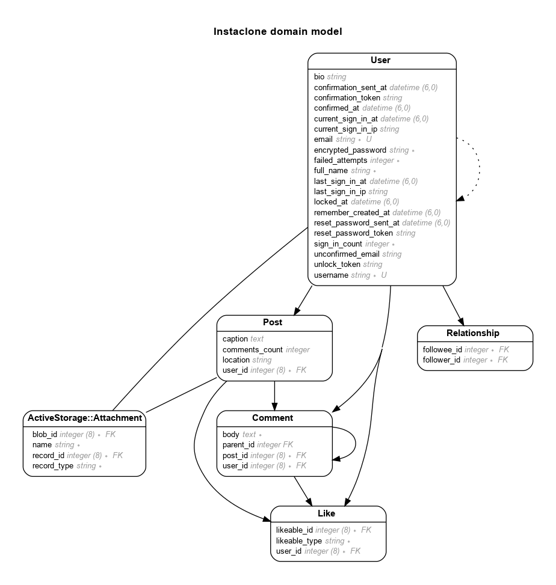

# README

Instaclone: This app is similar to Instagram. Helps me learn Ruby on Rails


Live - https://instaclone.dipenchauhan.com

## Model

Generated by Rails ERD. Run rails erd to regenerate (must have graphviz).


## Versions

- ruby 3.1.2p20 (2022-04-12 revision 4491bb740a) [x86_64-linux]
- Rails 7.0.4

## Standard Steps in all my apps:

- Add gems:

```ruby
gem "sassc-rails"
gem "image_processing", "~> 1.2"
gem "devise"
gem "rails-erd"

# In development group:
gem "annotate"
gem "faker"
# Preview email in the default browser instead of sending it.
gem "letter_opener"
```

- Rails erd:

  - Add .erdconfig file

  ```sh
  echo "attributes: content,foreign_key" > .erdconfig
  echo "filetype: png" >> .erdconfig
  ```

  - Run `bundle exec rails g erd:install`

- Annotate

  - Create routes.rake file:

  ```sh
  curl -LJ --output lib/tasks/routes.rake https://github.com/overdrivemachines/dipen_chauhan/raw/master/lib/tasks/routes.rake
  ```

  - Run `rails g annotate:install`

- Add Bootstrap - https://dev.to/overdrivemachines/add-bootstrap-5-and-font-awesome-6-to-rails-7-31b3

## Deployment instructions

```sh
ssh deploy@dipenchauhan.com
# Create postgres user for this app
sudo -u postgres createuser -s instaclone -P
# Create DB:
rails db:create
```
- Add the above password in credentials:
```sh
EDITOR="code --wait" rails credentials:edit
```
```
database_production:
  password: <your_password>
```
- Update database.yml:
```
production:
  <<: *default
  database: instaclone_production
  username: instaclone
  password: <%= Rails.application.credentials.database_production[:password] %>
```

## References

- PostgreSQL Setup
  - https://www.digitalocean.com/community/tutorials/how-to-use-postgresql-with-your-ruby-on-rails-application-on-ubuntu-20-04
  - https://www.youtube.com/watch?v=5QUTfcO7BEw
